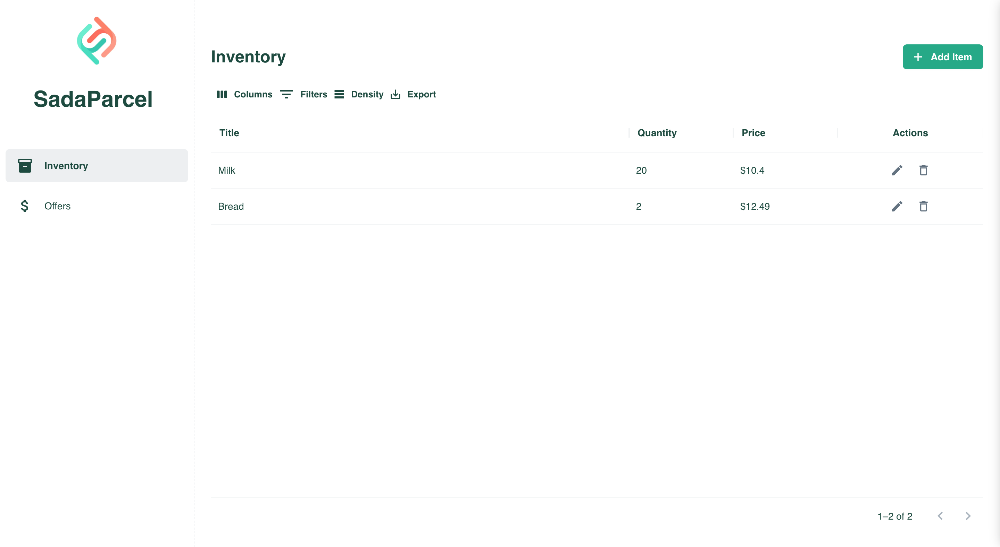
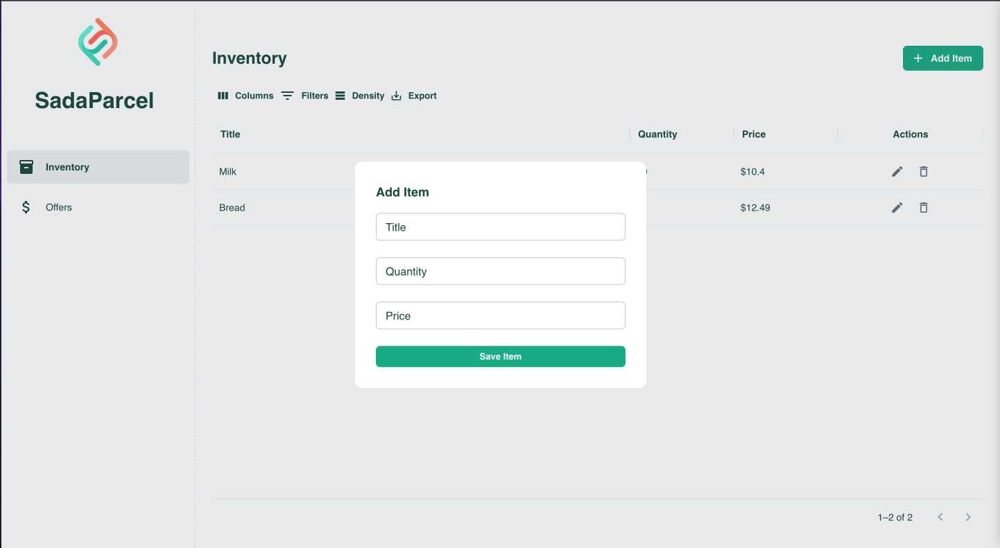
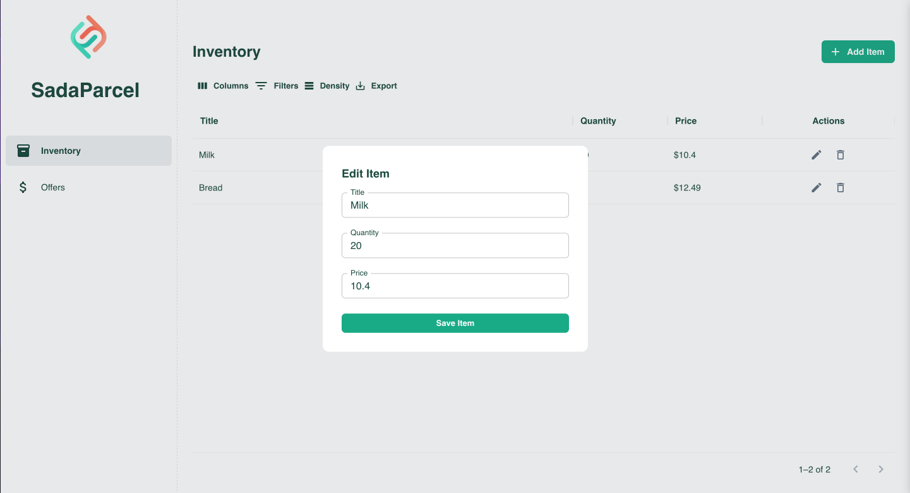
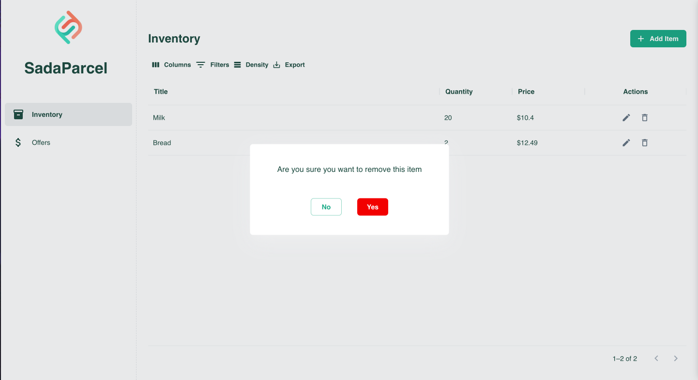
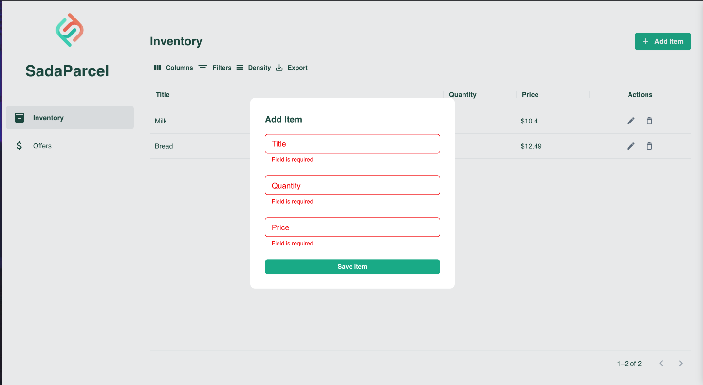
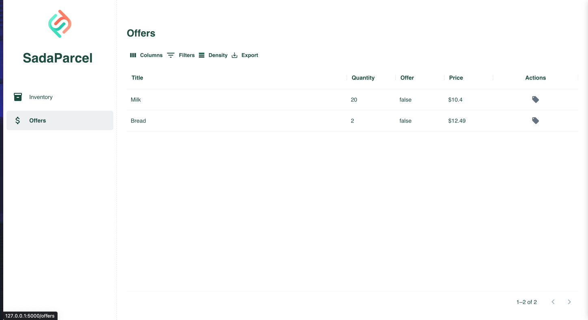
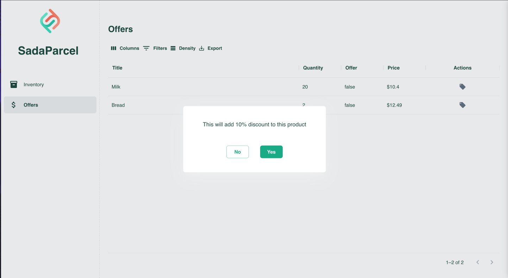
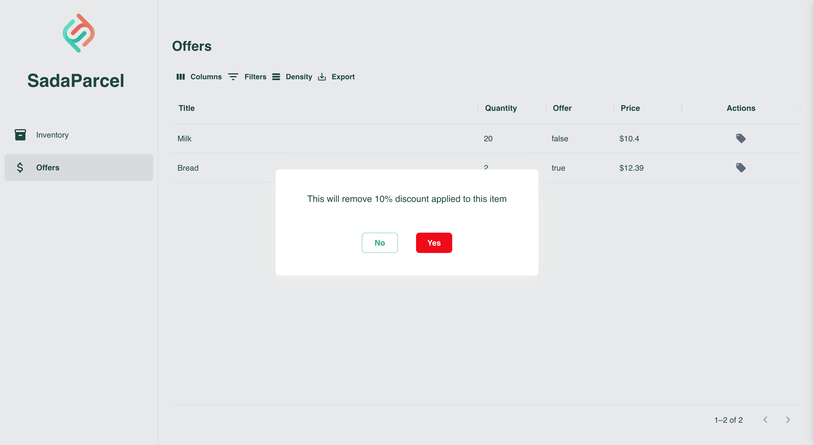

# Sadaparcel

Please consider following this project's author, [Abdullah Mujahid](https://github.com/abdullahmujahidali).

## Built With SPR ( SpringBoot PostgreSQL React )

* [React JS](https://reactjs.org/)
* [JAVA SpringBoot](https://spring.io/)
* [Postgres SQL](https://www.postgresql.org/)

## Project Features

* Staff member can add a new item to the inventory.
* Staff member can view all items in the inventory.
* Staff member can update an existing item to the inventory.
* Staff member can delete an item from the inventory.
* Staff member can view all the items which have offers and which have not.
* Staff member can add add/remove an offer from an item. (10% discount can be applied to a product).

## Prerequisites

* Node Js
* JAVA
* Postgres SQL

## SCREENSHOTS OF USER INTERFACE

### Main Screen

The screen below displays the item view, listing all items that form part of the inventory.

### Add ITEM

The screen below represents the "Add Item" functionality, where staff members can input data into the fields and, upon clicking "Save," the item will be added to the database.

### Edit Item

The screen below depicts the "Edit Item" functionality. Staff members can edit the data in the fields, and by clicking the "Save" button, the item is updated in the database.

### Remove Item

The following screen depicts the functionality for removing items from the inventory, allowing staff members to effortlessly delete any item from their records.

### Form Validation

This screen also showcases the front-end form validations in place.

### Offer Page

The following screen displays the offer page, featuring a Boolean field. If set to "true," this indicates that a 10% discount has already been applied to the item, with the current price reflecting a 10% deduction from the original. Conversely, if set to "false," this means the item is eligible for a 10% discount.

### Create Offer

By clicking the designated button, a 10% discount will be added to an item. 

### Remove Offer

Conversely, clicking the same button will remove any existing 10% discount applied to the item.

### Author

**Abdullah Mujahid**

* [LinkedIn Profile](https://https://www.linkedin.com/in/abdullah-mujahid-211849186/)
* [GitHub Profile](https://github.com/abdullahmujahidali)
* [Twitter Profile](https://twitter.com/abdulladgaf)

### License

Copyright © 20213, [Abdullah Mujahid](https://github.com/abdullahmujahidali).
Released under the [MIT License](LICENSE).
